# Diagramme de Classes (UML) — Maslaki

Architecture logique des modules et classes du projet Maslaki.

---

## Diagramme de Classes

```mermaid
classDiagram
    direction TB

    class DataBase {
        <<config>>
        +PDO $pdo
        +loadEnv()
    }

    class GeminiService {
        <<service>>
        -string $apiKey
        -string $baseUrl
        -bool $debugSsl
        -string $sslCertPath
        -array $models
        -int $maxRetries
        -int $retryDelay
        +ask(string $prompt, string $system) array
        +diagnostics() array
        -tryModel(string $model, string $prompt, string $system) array
        -sendRequest(string $model, string $prompt, string $system) array
        -buildPayload(string $prompt, string $system) array
        -extractText(array $decoded) string
        -cleanText(string $text) string
        -detectCaBundle() string
        -log503(string $model, array $result, int $attempt) void
        -loadEnv() void
    }

    class LangHelper {
        <<module>>
        +getLang() string
        +isRTL() bool
        +__(string $key) string
        +getLocalizedDbField(array $row, string $field) string
    }

    class Helpers {
        <<module>>
        +ensure_session() void
        +is_logged_in() bool
        +require_auth(string $redirectTo) void
        +current_user_id() int
        +json_response(mixed $data, int $statusCode) void
        +json_success(string $message, array $data) void
        +json_error(string $message, int $statusCode, array $data) void
        +localized_db_field(array $row, string $field) string
        +localize_row(array $row, array $fields) array
        +localize_rows(array $rows, array $fields) array
        +resolve_institution_image(string $name, string $dbImage) string
        +translate_type(string $type) string
        +is_ajax_request() bool
        +require_method(string $method, bool $exitOnFail) bool
    }

    class CSRFProtection {
        <<module>>
        +csrf_token() string
        +verify_csrf_token(string $token) bool
    }

    class PlatformAdmin {
        <<middleware>>
        +platform_admin_role(PDO $pdo, int $userId) string
        +is_platform_admin(PDO $pdo) bool
        +is_superadmin(PDO $pdo) bool
        +require_platform_admin(PDO $pdo) void
        +require_superadmin(PDO $pdo) void
    }

    class Student {
        <<entity>>
        +int $id
        +string $name
        +string $email
        +string $password
        +string $bac_branch
        +float $average
        +string $city
        +string $role
        +boolean $is_premium
        +timestamp $created_at
    }

    class AdminUser {
        <<entity>>
        +int $id
        +string $username
        +string $email
        +string $password
        +enum $role
        +timestamp $created_at
    }

    class Institution {
        <<entity>>
        +int $id
        +string $name
        +string $name_ar
        +string $name_en
        +string $city
        +string $type
        +float $seuil
        +float $min_average
        +text $description
        +text $requirements
        +string $diplome
        +string $duree_etudes
        +string $image
        +string $site_web
        +boolean $is_popular
    }

    class Filiere {
        <<entity>>
        +int $id
        +string $nom
        +string $nom_ar
        +string $nom_en
        +text $description
    }

    class Categorie {
        <<entity>>
        +int $id
        +string $nom
        +string $nom_ar
        +string $nom_en
    }

    class Ville {
        <<entity>>
        +int $id
        +string $nom
        +string $nom_ar
        +string $nom_en
    }

    class BacType {
        <<entity>>
        +int $id
        +string $code
        +string $nom
        +string $nom_ar
        +string $nom_en
    }

    class Review {
        <<entity>>
        +int $id
        +text $content
        +enum $status
        +timestamp $created_at
    }

    class Notification {
        <<entity>>
        +int $id
        +string $title
        +text $message
        +enum $type
        +string $related_link
        +boolean $is_global
        +timestamp $created_at
    }

    class Contest {
        <<entity>>
        +int $id
        +string $title
        +text $description
        +date $exam_date
        +date $registration_deadline
        +enum $status
        +boolean $is_featured
    }

    class Appointment {
        <<entity>>
        +int $id
        +string $title
        +date $appointment_date
        +time $appointment_time
        +enum $status
    }

    class AIRecommendation {
        <<entity>>
        +int $id
        +text $result
        +timestamp $created_at
    }

    class Deadline {
        <<entity>>
        +int $id
        +date $deadline_date
    }

    class SavedSchool {
        <<entity>>
        +int $id
        +timestamp $created_at
    }

    class PremiumPlan {
        <<entity>>
        +int $id
        +string $name
        +float $price
        +int $duration_days
        +text $features
    }

    class StudentSubscription {
        <<entity>>
        +int $id
        +timestamp $start_date
        +timestamp $end_date
        +enum $status
    }

    class HomeController {
        <<controller>>
        +index() void
    }

    class AuthController {
        <<controller>>
        +login() void
        +loginProcess() void
        +register() void
        +registerProcess() void
        +googleCallback() void
        +logout() void
    }

    class InstitutionController {
        <<controller>>
        +list() void
        +detail(int $id) void
        +searchAjax() void
    }

    class DashboardController {
        <<controller>>
        +index() void
        +savedSchools() void
        +notifications() void
        +appointments() void
    }

    class OrientationController {
        <<controller>>
        +aiForm() void
        +aiProcess() void
        +explore() void
        +domainDetails() void
        +filiereDetails() void
    }

    class AdminController {
        <<controller>>
        +dashboard() void
        +reviews() void
        +sendNotification() void
        +manageUsers() void
        +addInstitution() void
    }

    %% Service dependencies
    HomeController --> DataBase : uses $pdo
    HomeController --> LangHelper : translations
    HomeController ..> Institution : displays

    AuthController --> DataBase : uses $pdo
    AuthController --> Helpers : require_auth, current_user_id
    AuthController ..> Student : authenticates

    InstitutionController --> DataBase : uses $pdo
    InstitutionController --> LangHelper : getLocalizedDbField
    InstitutionController --> CSRFProtection : csrf_token
    InstitutionController ..> Institution : queries
    InstitutionController ..> Filiere : queries
    InstitutionController ..> Review : queries

    DashboardController --> DataBase : uses $pdo
    DashboardController --> Helpers : require_auth
    DashboardController ..> Student : current user
    DashboardController ..> SavedSchool : queries
    DashboardController ..> Contest : queries
    DashboardController ..> Deadline : queries

    OrientationController --> DataBase : uses $pdo
    OrientationController --> GeminiService : ask()
    OrientationController ..> Institution : recommends
    OrientationController ..> AIRecommendation : stores

    AdminController --> DataBase : uses $pdo
    AdminController --> PlatformAdmin : require_platform_admin
    AdminController --> CSRFProtection : csrf_token
    AdminController ..> Review : moderate
    AdminController ..> Notification : send
    AdminController ..> Institution : creates

    %% Entity relationships
    Student "1" --> "0..*" Review : writes
    Student "1" --> "0..*" SavedSchool : saves
    Student "1" --> "0..*" Appointment : books
    Student "1" --> "0..*" AIRecommendation : generates
    Student "1" --> "0..*" StudentSubscription : subscribes
    Institution "1" --> "0..*" Review : receives
    Institution "1" --> "0..*" Contest : organizes
    Institution "1" --> "0..*" Deadline : has
    Institution "*" --> "*" Filiere : offers
    Institution "*" --> "0..1" Ville : located in
    Filiere "*" --> "0..1" Categorie : belongs to
    PremiumPlan "1" --> "0..*" StudentSubscription : plan
```

---

## Description des Classes

### Services

| Classe | Fichier | Responsabilité |
|---|---|---|
| **GeminiService** | `services/GeminiService.php` | Intégration API Google Gemini pour l'orientation IA avec retry automatique et fallback multi-modèles |

### Modules d'Infrastructure

| Module | Fichier | Responsabilité |
|---|---|---|
| **DataBase** | `config/DataBase.php` | Connexion PDO via variables d'environnement (.env) |
| **LangHelper** | `includes/lang_helper.php` | Système de traduction i18n (FR/EN/AR) et localisation des champs DB |
| **Helpers** | `includes/helpers.php` | Authentification, réponses JSON, localisation, résolution d'images, validation de requêtes |
| **CSRFProtection** | `includes/csrf.php` | Génération et vérification de tokens CSRF pour les formulaires |
| **PlatformAdmin** | `includes/platform_admin.php` | Middleware d'autorisation admin/superadmin avec gardes d'accès |

### Entités (correspondance avec les tables DB)

| Entité | Table | Description |
|---|---|---|
| **Student** | students | Étudiant utilisateur de la plateforme |
| **AdminUser** | admin_users | Administrateur (superadmin ou manager) |
| **Institution** | institutions | Établissement d'enseignement supérieur |
| **Filiere** | filieres | Spécialité / programme d'études |
| **Categorie** | categories | Domaine d'études |
| **Ville** | villes | Ville marocaine |
| **BacType** | bac_types | Série de baccalauréat |
| **Review** | reviews | Avis d'un étudiant sur un établissement |
| **Notification** | notifications | Message système |
| **Contest** | contests | Concours d'accès |
| **Appointment** | appointments | Rendez-vous d'orientation |
| **AIRecommendation** | ai_recommendations | Recommandation IA |
| **Deadline** | deadlines | Date limite de candidature |
| **SavedSchool** | saved_schools | École favorite d'un étudiant |
| **PremiumPlan** | premium_plans | Plan d'abonnement premium |
| **StudentSubscription** | student_subscriptions | Souscription premium |

### Contrôleurs (fichiers PHP principaux)

| Contrôleur | Fichiers associés | Fonctionnalités |
|---|---|---|
| **HomeController** | `index.php` | Page d'accueil, statistiques, écoles populaires |
| **AuthController** | `login_process.php`, `register_process.php`, `google_callback.php`, `views/login.php`, `views/register.php`, `views/logout.php` | Authentification, inscription, OAuth Google |
| **InstitutionController** | `views/institutions.php`, `views/institution_detail.php`, `search_ajax.php` | Liste filtrable, détails, recherche AJAX |
| **DashboardController** | `views/dashboard.php`, `views/saved_schools.php`, `views/notifications.php`, `views/appointments.php` | Tableau de bord, favoris, notifications, rendez-vous |
| **OrientationController** | `views/ai_form.php`, `ai_process.php`, `views/orientation_explore.php`, `views/domain_details.php`, `views/filiere_details.php` | Formulaire IA, résultats, exploration par domaine |
| **AdminController** | `views/admin_dashboard.php`, `views/admin_reviews.php`, `views/admin_send_notification.php`, `views/admin_users_manage.php`, `views/admin_add_institution.php`, `process_add_institution.php` | Dashboard admin, modération, notifications, gestion des rôles, ajout d'établissement |
