# Modèle Conceptuel des Données (MCD) — Maslaki

Plateforme d'orientation universitaire pour les étudiants au Maroc.

---

## Diagramme Entité-Association

```mermaid
erDiagram
    STUDENT {
        int id PK
        string name
        string email UK
        string password
        string bac_branch
        float average
        string city
        string role
        boolean is_premium
        timestamp created_at
    }

    ADMIN_USER {
        int id PK
        string username UK
        string email UK
        string password
        enum role "superadmin | manager"
        timestamp created_at
    }

    VILLE {
        int id PK
        string nom
        string nom_ar
        string nom_en
    }

    CATEGORY {
        int id PK
        string nom
        string nom_ar
        string nom_en
    }

    BAC_TYPE {
        int id PK
        string code
        string nom
        string nom_ar
        string nom_en
    }

    INSTITUTION {
        int id PK
        string name
        string name_ar
        string name_en
        string city
        string city_ar
        string city_en
        string type
        float min_average
        float seuil
        text description
        text description_ar
        text description_en
        text requirements
        text requirements_ar
        text requirements_en
        string diplome
        string diplome_ar
        string diplome_en
        string duree_etudes
        string image
        string site_web
        boolean is_popular
        timestamp created_at
    }

    FILIERE {
        int id PK
        string nom
        string nom_ar
        string nom_en
        text description
        text description_ar
        text description_en
    }

    REVIEW {
        int id PK
        text content
        enum status "pending | approved"
        timestamp created_at
    }

    NOTIFICATION {
        int id PK
        string title
        text message
        enum type "system | school | filiere | announcement | maintenance | orientation | deadline"
        string related_link
        boolean is_global
        timestamp created_at
    }

    USER_NOTIFICATION {
        int id PK
        boolean is_read
        boolean is_deleted
        timestamp read_at
    }

    USER_REQUEST {
        int id PK
        enum type "suggestion | report | support | other"
        string subject
        text message
        enum status "pending | seen | resolved"
        timestamp created_at
    }

    ADMIN_NOTIFICATION {
        int id PK
        string type
        text message
        string link
        boolean is_read
        timestamp created_at
    }

    AI_RECOMMENDATION {
        int id PK
        text result
        timestamp created_at
    }

    APPOINTMENT {
        int id PK
        string title
        date appointment_date
        time appointment_time
        enum status "pending | confirmed | cancelled"
        timestamp created_at
    }

    CONTEST {
        int id PK
        string title
        text description
        date exam_date
        date registration_deadline
        enum status "open | closed | soon"
        boolean is_featured
        timestamp created_at
    }

    DEADLINE {
        int id PK
        date deadline_date
    }

    SAVED_SCHOOL {
        int id PK
        timestamp created_at
    }

    TRANSLATION {
        int id PK
        string lang
        string key
        text value
    }

    PREMIUM_PLAN {
        int id PK
        string name
        float price
        int duration_days
        text features
    }

    STUDENT_SUBSCRIPTION {
        int id PK
        timestamp start_date
        timestamp end_date
        enum status "active | expired | cancelled"
    }

    %% ── Relations ──

    VILLE ||--o{ INSTITUTION : "abrite (1,N)"
    CATEGORY ||--o{ FILIERE : "regroupe (1,N)"
    INSTITUTION }o..o{ FILIERE : "propose (N,M)"
    STUDENT ||--o{ REVIEW : "redige (0,N)"
    INSTITUTION ||--o{ REVIEW : "recoit (0,N)"
    STUDENT }o..o{ INSTITUTION : "sauvegarde en favoris (N,M)"
    STUDENT ||--o{ NOTIFICATION : "cible de (0,N)"
    STUDENT }o..o{ NOTIFICATION : "statut de lecture (N,M)"
    STUDENT ||--o{ USER_REQUEST : "soumet (0,N)"
    STUDENT ||--o{ AI_RECOMMENDATION : "genere (0,N)"
    STUDENT ||--o{ APPOINTMENT : "reserve (0,N)"
    INSTITUTION ||--o{ CONTEST : "organise (0,N)"
    INSTITUTION ||--o{ DEADLINE : "possede (0,N)"
    STUDENT ||--o{ STUDENT_SUBSCRIPTION : "souscrit (0,N)"
    PREMIUM_PLAN ||--o{ STUDENT_SUBSCRIPTION : "correspond a (1,N)"
    INSTITUTION }o..o{ BAC_TYPE : "accepte (N,M)"
```

---

## Description des Entités

| Entité | Description |
|---|---|
| **STUDENT** | Étudiant utilisateur de la plateforme |
| **ADMIN_USER** | Administrateur de la plateforme (superadmin ou manager) |
| **VILLE** | Référentiel géographique des villes marocaines |
| **CATEGORY** | Grand domaine d'études (Sciences, Santé, Informatique…) |
| **BAC_TYPE** | Séries de baccalauréat marocain (SMA, PC, SVT, ECO…) |
| **INSTITUTION** | Établissement d'enseignement supérieur (ENSA, ENCG, FST, EST…) |
| **FILIERE** | Spécialité / programme d'études |
| **REVIEW** | Avis/commentaire d'un étudiant sur un établissement |
| **NOTIFICATION** | Message système (global ou ciblé) envoyé aux étudiants |
| **USER_NOTIFICATION** | Statut de lecture/suppression d'une notification par utilisateur |
| **USER_REQUEST** | Demande de support soumise par un étudiant |
| **ADMIN_NOTIFICATION** | Alerte interne destinée à l'équipe d'administration |
| **AI_RECOMMENDATION** | Résultat d'orientation généré par l'IA pour un étudiant |
| **APPOINTMENT** | Rendez-vous d'orientation réservé par un étudiant |
| **CONTEST** | Concours d'accès organisé par un établissement |
| **DEADLINE** | Date limite de candidature pour un établissement |
| **SAVED_SCHOOL** | Association entre un étudiant et ses écoles favorites |
| **TRANSLATION** | Entrée du dictionnaire de traduction (clé/valeur par langue) |
| **PREMIUM_PLAN** | Plan d'abonnement premium (tarif, durée, fonctionnalités) |
| **STUDENT_SUBSCRIPTION** | Souscription d'un étudiant à un plan premium |

---

## Description des Associations

| Association | Entités | Cardinalités | Description |
|---|---|---|---|
| **abrite** | VILLE ↔ INSTITUTION | 1,N / 0,1 | Une ville abrite plusieurs institutions |
| **regroupe** | CATEGORY ↔ FILIERE | 1,N / 0,1 | Une catégorie regroupe plusieurs filières |
| **propose** | INSTITUTION ↔ FILIERE | N,M | Une institution propose plusieurs filières ; une filière est offerte par plusieurs institutions |
| **rédige** | STUDENT → REVIEW | 0,N | Un étudiant rédige plusieurs avis |
| **reçoit** | INSTITUTION → REVIEW | 0,N | Une institution reçoit plusieurs avis |
| **sauvegarde en favoris** | STUDENT ↔ INSTITUTION | N,M | Un étudiant sauvegarde plusieurs écoles ; une école est sauvegardée par plusieurs étudiants |
| **cible de** | STUDENT ↔ NOTIFICATION | 0,N / 0,1 | Une notification peut cibler un étudiant spécifique |
| **statut de lecture** | STUDENT ↔ NOTIFICATION | N,M | Un étudiant interagit avec plusieurs notifications (lu, supprimé) |
| **soumet** | STUDENT → USER_REQUEST | 0,N | Un étudiant soumet des requêtes de support |
| **génère** | STUDENT → AI_RECOMMENDATION | 0,N | Un étudiant génère plusieurs recommandations IA |
| **réserve** | STUDENT → APPOINTMENT | 0,N | Un étudiant réserve plusieurs rendez-vous |
| **organise** | INSTITUTION → CONTEST | 0,N | Une institution organise plusieurs concours |
| **possède** | INSTITUTION → DEADLINE | 0,N | Une institution a plusieurs dates limites |
| **souscrit** | STUDENT → STUDENT_SUBSCRIPTION | 0,N | Un étudiant a un historique de souscriptions |
| **correspond à** | PREMIUM_PLAN → STUDENT_SUBSCRIPTION | 1,N | Un plan correspond à plusieurs souscriptions |
| **accepte** | INSTITUTION ↔ BAC_TYPE | N,M | Une institution accepte plusieurs types de bac |
