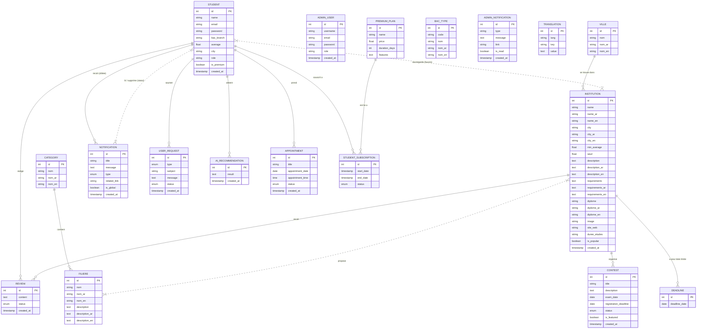

# Modélisation des Données (MCD & MLD) — Projet Maslaki

Ce document présente la modélisation conceptuelle (MCD) et logique (MLD) de la base de données du projet **Maslaki**, une plateforme d'orientation et d'accompagnement pour les étudiants au Maroc.

---

## 1. Modèle Conceptuel des Données (MCD)

Le MCD décrit les entités du système, leurs attributs et les relations (associations) qui les lient, ainsi que les cardinalités correspondantes.

### 1.1 Diagramme Entité-Association (Mermaid)

---

### 1.2 Liste des Entités et Attributs

1. **STUDENT (Étudiant)** : Représente les utilisateurs de la plateforme qui cherchent une orientation.
   - `id` (Entier, PK) : Identifiant unique de l'étudiant.
   - `name` (Texte) : Nom complet.
   - `email` (Texte) : Adresse e-mail unique (sert d'identifiant de connexion).
   - `password` (Texte) : Mot de passe haché.
   - `bac_branch` (Texte) : Option de baccalauréat (ex: SVT, PC, SMA...).
   - `average` (Réel) : Moyenne générale obtenue ou estimée.
   - `city` (Texte) : Ville de résidence de l'étudiant.
   - `role` (Texte) : Rôle dans le système (par défaut 'student').
   - `is_premium` (Booléen) : Indicateur d'abonnement premium actif.
   - `created_at` (Date/Heure) : Date d'inscription.

2. **ADMIN_USER (Administrateur)** : Membres de l'équipe de gestion de la plateforme.
   - `id` (Entier, PK) : Identifiant unique de l'administrateur.
   - `username` (Texte) : Nom d'utilisateur unique.
   - `email` (Texte) : Adresse e-mail unique.
   - `password` (Texte) : Mot de passe haché.
   - `role` (Enum: superadmin, manager) : Niveau de privilèges.
   - `created_at` (Date/Heure) : Date de création du compte.

3. **VILLE (Ville)** : Référentiel géographique pour localiser les établissements.
   - `id` (Entier, PK) : Identifiant unique.
   - `nom` (Texte) : Nom en français.
   - `nom_ar` (Texte) : Nom en arabe.
   - `nom_en` (Texte) : Nom en anglais.

4. **CATEGORY (Catégorie / Secteur)** : Grands domaines d'études (ex: Sciences, Technologie, Santé...).
   - `id` (Entier, PK) : Identifiant de la catégorie.
   - `nom` (Texte) : Nom en français.
   - `nom_ar` (Texte) : Nom en arabe.
   - `nom_en` (Texte) : Nom en anglais.

5. **BAC_TYPE (Série de Baccalauréat)** : Options officielles de baccalauréat marocain (ex: SMA, PC, ECO...).
   - `id` (Entier, PK) : Identifiant.
   - `code` (Texte) : Code abrégé de la filière (ex: 'PC').
   - `nom` (Texte) : Libellé français.
   - `nom_ar` (Texte) : Libellé arabe.
   - `nom_en` (Texte) : Libellé anglais.

6. **INSTITUTION (Établissement)** : Écoles, instituts ou facultés répertoriés (ex: ENSA, ENCG, FST...).
   - `id` (Entier, PK) : Identifiant.
   - `name`, `name_ar`, `name_en` (Texte) : Noms multilingues.
   - `city`, `city_ar`, `city_en` (Texte) : Noms de ville redondants (pour compatibilité).
   - `min_average` (Réel) : Note minimale pour postuler (sélection dossier).
   - `seuil` (Réel) : Seuil d'accès effectif des années précédentes.
   - `description`, `description_ar`, `description_en` (Texte long) : Descriptions détaillées.
   - `requirements`, `requirements_ar`, `requirements_en` (Texte long) : Conditions requises.
   - `diplome`, `diplome_ar`, `diplome_en` (Texte) : Nature du diplôme délivré.
   - `image` (Texte) : Chemin d'accès ou nom du fichier image de l'établissement.
   - `site_web` (Texte) : URL du site officiel de l'école.
   - `duree_etudes` (Texte) : Durée du cursus (ex: "5 ans").
   - `is_popular` (Booléen) : Indicateur de mise en avant.
   - `created_at` (Date/Heure) : Date d'ajout de la fiche.

7. **FILIERE (Filière / Programme)** : Spécialités d'études proposées (ex: Génie Informatique, Finance...).
   - `id` (Entier, PK) : Identifiant.
   - `nom`, `nom_ar`, `nom_en` (Texte) : Titres multilingues.
   - `description`, `description_ar`, `description_en` (Texte long) : Descriptifs du programme.

8. **REVIEW (Avis)** : Commentaires rédigés par les étudiants sur les établissements.
   - `id` (Entier, PK) : Identifiant.
   - `content` (Texte long) : Texte du commentaire.
   - `status` (Enum: pending, approved) : Statut de modération.
   - `created_at` (Date/Heure) : Date de soumission.

9. **NOTIFICATION (Notification globale ou ciblée)** : Messages envoyés aux utilisateurs.
   - `id` (Entier, PK) : Identifiant.
   - `title` (Texte) : Titre du message.
   - `message` (Texte long) : Corps de la notification.
   - `type` (Enum: system, school, filiere, announcement, maintenance, orientation, deadline) : Type de notification.
   - `related_link` (Texte) : URL relative vers une page interne.
   - `is_global` (Booléen) : Indique si la notification s'adresse à tout le monde.
   - `created_at` (Date/Heure) : Date de création.

10. **USER_REQUEST (Requête de Support)** : Demandes ou signalements d'étudiants pour les administrateurs.
    - `id` (Entier, PK) : Identifiant.
    - `type` (Enum: suggestion, report, support, other) : Type de demande.
    - `subject` (Texte) : Sujet.
    - `message` (Texte long) : Détail de la demande.
    - `status` (Enum: pending, seen, resolved) : Statut du traitement.
    - `created_at` (Date/Heure) : Date d'émission.

11. **ADMIN_NOTIFICATION (Notification Interne Admin)** : Alertes destinées à l'équipe de modération (ex: nouveau commentaire à valider).
    - `id` (Entier, PK) : Identifiant.
    - `type` (Texte) : Type d'événement.
    - `message` (Texte long) : Contenu de l'alerte.
    - `link` (Texte) : Lien direct pour traiter l'action dans le panel admin.
    - `is_read` (Booléen) : Statut de lecture.
    - `created_at` (Date/Heure) : Date de survenue.

12. **AI_RECOMMENDATION (Recommandation IA)** : Résultats d'orientation personnalisés générés par l'IA pour un étudiant.
    - `id` (Entier, PK) : Identifiant.
    - `result` (Texte long / JSON) : Rapport complet de recommandations d'écoles/filières.
    - `created_at` (Date/Heure) : Date du calcul.

13. **APPOINTMENT (Rendez-vous)** : Réservations de créneaux d'orientation ou d'entretien.
    - `id` (Entier, PK) : Identifiant.
    - `title` (Texte) : Motif/Titre.
    - `appointment_date` (Date) : Date du rendez-vous.
    - `appointment_time` (Heure) : Heure de début.
    - `status` (Enum: pending, confirmed, cancelled) : État de la réservation.
    - `created_at` (Date/Heure) : Date de prise du rendez-vous.

14. **CONTEST (Concours)** : Épreuves écrites ou orales organisées par les écoles pour y accéder.
    - `id` (Entier, PK) : Identifiant.
    - `title` (Texte) : Nom du concours.
    - `description` (Texte long) : Description et déroulement.
    - `exam_date` (Date) : Date du concours.
    - `registration_deadline` (Date) : Date limite d'inscription.
    - `status` (Enum: open, closed, soon) : Statut actuel.
    - `is_featured` (Booléen) : Événement mis en valeur sur le tableau de bord.
    - `created_at` (Date/Heure) : Date de création.

15. **DEADLINE (Date Limite)** : Échéances importantes pour les dossiers de candidature.
    - `id` (Entier, PK) : Identifiant.
    - `deadline_date` (Date) : Date d'échéance.

16. **TRANSLATION (Traduction de l'interface)** : Dictionnaire de traduction clé/valeur pour l'internationalisation.
    - `id` (Entier, PK) : Identifiant de la traduction.
    - `lang` (Texte) : Code langue (ex: 'fr', 'ar', 'en').
    - `key` (Texte) : Clé de traduction.
    - `value` (Texte long) : Traduction correspondante.

17. **PREMIUM_PLAN (Plan Premium)** : Tarifications et fonctionnalités disponibles pour l'accès Premium.
    - `id` (Entier, PK) : Identifiant.
    - `name` (Texte) : Titre de l'offre.
    - `price` (Réel) : Prix du forfait.
    - `duration_days` (Entier) : Durée de validité en jours.
    - `features` (Texte long) : Liste des bénéfices/avantages inclus.

18. **STUDENT_SUBSCRIPTION (Abonnement souscrit)** : Historique des souscriptions des étudiants aux plans premium.
    - `id` (Entier, PK) : Identifiant.
    - `start_date` (Date/Heure) : Début de l'abonnement.
    - `end_date` (Date/Heure) : Fin prévue de validité.
    - `status` (Enum: active, expired, cancelled) : Statut de validité.

---

### 1.3 Description des Associations (Relations)

- **se trouve dans** (`VILLE` 1:N `INSTITUTION`) : Une ville peut abriter plusieurs institutions (1,N), mais une institution n'appartient qu'à une seule ville (0,1 ou 1,1).
- **contient** (`CATEGORY` 1:N `FILIERE`) : Une catégorie contient plusieurs filières (1,N), et une filière appartient à une seule catégorie principale (0,1).
- **propose** (`INSTITUTION` N:M `FILIERE`) : Une institution propose plusieurs filières d'études (0,N), et une filière d'études peut être enseignée au sein de plusieurs institutions (0,N). Cette relation porteuse de cardinalités multiples (N,M) engendre une table de liaison (pivot).
- **redige** / **recoit** (`STUDENT` 1:N `REVIEW` / `INSTITUTION` 1:N `REVIEW`) : Un étudiant peut rédiger plusieurs avis (0,N), un avis est rédigé par un seul étudiant (1,1 ou 0,1 si compte supprimé). Une institution reçoit plusieurs avis (0,N), un avis donné cible une seule école (1,1).
- **sauvegarde (favoris)** (`STUDENT` N:M `INSTITUTION`) : Un étudiant peut mettre en favoris plusieurs institutions (0,N), et une institution peut être mise en favoris par plusieurs étudiants (0,N). Cela donne lieu à une table pivot.
- **recoit (ciblee)** (`STUDENT` 1:N `NOTIFICATION`) : Une notification nominative / privée cible un seul étudiant (1,1), un étudiant peut recevoir plusieurs notifications privées (0,N).
- **statut de lecture** (`STUDENT` N:M `NOTIFICATION`) : Permet de stocker de manière dynamique si un étudiant a lu ou masqué/supprimé une notification globale. Un étudiant interagit avec plusieurs notifications (0,N), et une notification est suivie par plusieurs étudiants (0,N).
- **soumet** (`STUDENT` 1:N `USER_REQUEST`) : Un étudiant peut soumettre plusieurs requêtes/tickets de support (0,N), un ticket appartient à un étudiant unique (0,1).
- **obtient** (`STUDENT` 1:N `AI_RECOMMENDATION`) : Un étudiant peut générer plusieurs rapports de recommandations IA au fil du temps (0,N), chaque rapport appartient à un étudiant unique (0,1).
- **prend** (`STUDENT` 1:N `APPOINTMENT`) : Un étudiant peut réserver plusieurs rendez-vous (0,N), chaque rendez-vous concerne un étudiant unique (1,1).
- **organise** (`INSTITUTION` 1:N `CONTEST`) : Une institution organise plusieurs concours (0,N), un concours est lié à une seule institution organisatrice (1,1).
- **a pour date limite** (`INSTITUTION` 1:N `DEADLINE`) : Une institution possède des dates limites spécifiques (0,N), une date limite est rattachée à une institution (0,1).
- **souscrit a** / **est lie a** (`STUDENT` 1:N `STUDENT_SUBSCRIPTION` / `PREMIUM_PLAN` 1:N `STUDENT_SUBSCRIPTION`) : Un étudiant peut avoir plusieurs souscriptions successives dans l'historique (0,N), une souscription appartient à un étudiant unique (1,1). Un abonnement fait référence à un forfait tarifaire (1,1), un forfait peut être associé à plusieurs abonnements (0,N).

---

## 2. Modèle Logique des Données (MLD)

Le Modèle Logique des Données traduit les entités et relations en structures relationnelles adaptées aux bases de données SQL. Les clés primaires sont soulignées et les clés étrangères sont préfixées par `#`.

### 2.1 Schéma Relationnel Textuel

* **admin_users** (<u>id</u>, username, email, password, role, created_at)
* **villes** (<u>id</u>, nom, nom_ar, nom_en)
* **categories** (<u>id</u>, nom, nom_ar, nom_en)
* **bac_types** (<u>id</u>, code, nom, nom_ar, nom_en)
* **students** (<u>id</u>, name, email, password, bac_branch, average, city, role, is_premium, created_at)
* **institutions** (<u>id</u>, name, name_ar, name_en, city, city_ar, city_en, #ville_id, type, min_average, seuil, description, description_ar, description_en, requirements, requirements_ar, requirements_en, diplome, diplome_ar, diplome_en, image, site_web, duree_etudes, is_popular, created_at)
  * *Clé étrangère* : `#ville_id` en référence à `villes(id)` avec option `ON DELETE SET NULL`.
* **filieres** (<u>id</u>, nom, nom_ar, nom_en, description, description_ar, description_en, #categorie_id)
  * *Clé étrangère* : `#categorie_id` en référence à `categories(id)` avec option `ON DELETE SET NULL`.
* **institution_filieres** (<u>#institution_id</u>, <u>#filiere_id</u>)
  * *Clé primaire composée* : `(institution_id, filiere_id)`
  * *Clé étrangère 1* : `#institution_id` en référence à `institutions(id)` avec option `ON DELETE CASCADE`.
  * *Clé étrangère 2* : `#filiere_id` en référence à `filieres(id)` avec option `ON DELETE CASCADE`.
* **reviews** (<u>id</u>, #student_id, #institution_id, content, status, created_at)
  * *Clé étrangère 1* : `#student_id` en référence à `students(id)` avec option `ON DELETE SET NULL`.
  * *Clé étrangère 2* : `#institution_id` en référence à `institutions(id)` avec option `ON DELETE CASCADE`.
* **saved_schools** (<u>id</u>, #student_id, #institution_id, created_at)
  * *Clé étrangère 1* : `#student_id` en référence à `students(id)` avec option `ON DELETE CASCADE`.
  * *Clé étrangère 2* : `#institution_id` en référence à `institutions(id)` avec option `ON DELETE CASCADE`.
* **notifications** (<u>id</u>, title, message, type, related_link, is_global, #target_user_id, created_at)
  * *Clé étrangère* : `#target_user_id` en référence à `students(id)` avec option `ON DELETE CASCADE`.
* **user_notifications** (<u>id</u>, #user_id, #notification_id, is_read, is_deleted, read_at)
  * *Contrainte unique* : `(user_id, notification_id)`
  * *Clé étrangère 1* : `#user_id` en référence à `students(id)` avec option `ON DELETE CASCADE`.
  * *Clé étrangère 2* : `#notification_id` en référence à `notifications(id)` avec option `ON DELETE CASCADE`.
* **user_requests** (<u>id</u>, #student_id, type, subject, message, status, created_at)
  * *Clé étrangère* : `#student_id` en référence à `students(id)` avec option `ON DELETE SET NULL`.
* **admin_notifications** (<u>id</u>, type, message, link, is_read, created_at)
* **ai_recommendations** (<u>id</u>, #student_id, result, created_at)
  * *Clé étrangère* : `#student_id` en référence à `students(id)` avec option `ON DELETE CASCADE`.
* **appointments** (<u>id</u>, #student_id, title, appointment_date, appointment_time, status, created_at)
  * *Clé étrangère* : `#student_id` en référence à `students(id)` avec option `ON DELETE CASCADE`.
* **contests** (<u>id</u>, #institution_id, title, description, exam_date, registration_deadline, status, is_featured, created_at)
  * *Clé étrangère* : `#institution_id` en référence à `institutions(id)` avec option `ON DELETE CASCADE`.
* **deadlines** (<u>id</u>, #institution_id, deadline_date)
  * *Clé étrangère* : `#institution_id` en référence à `institutions(id)` avec option `ON DELETE CASCADE`.
* **translations** (<u>id</u>, lang, key, value)
  * *Contrainte unique* : `(lang, key)`
* **premium_plans** (<u>id</u>, name, price, duration_days, features)
* **student_subscriptions** (<u>id</u>, #student_id, #plan_id, start_date, end_date, status)
  * *Clé étrangère 1* : `#student_id` en référence à `students(id)` avec option `ON DELETE CASCADE`.
  * *Clé étrangère 2* : `#plan_id` en référence à `premium_plans(id)` avec option `ON DELETE CASCADE`.

---

### 2.2 Règles de Passage du MCD au MLD appliquées

1. **Règle des relations de type 1:N** (ex: `VILLE` vers `INSTITUTION`) : 
   La clé primaire de l'entité côté "1" (`villes.id`) est migrée comme clé étrangère (`ville_id`) dans l'entité côté "N" (`institutions`).
2. **Règle des relations de type N:M** (ex: `INSTITUTION` et `FILIERE`) :
   L'association se transforme en une table de liaison (`institution_filieres`) dont la clé primaire est composée des clés primaires des deux entités concernées (`(institution_id, filiere_id)`). Ces clés deviennent également des clés étrangères.
3. **Règle de l'héritage / Spécialisation** :
   Dans cette implémentation, les comptes d'administration (`admin_users`) et les étudiants (`students`) sont modélisés dans deux tables indépendantes distinctes car ils ont des cycles de vie et des structures de données très différents, sans table générique de base (Stratégie de partitionnement en tables concrètes).
