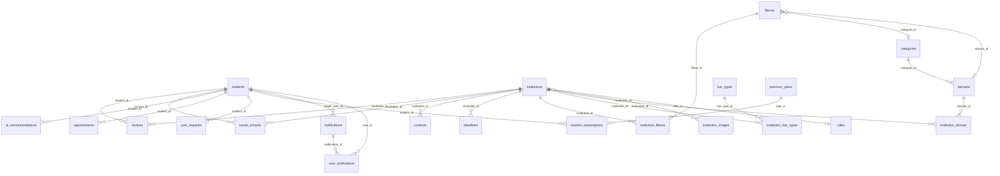

# Modèle Logique des Données (MLD) — Maslaki

Le MLD traduit le MCD en tables relationnelles pour MySQL/MariaDB.  
**Convention** : <u>souligné</u> = clé primaire (PK), **#préfixe** = clé étrangère (FK).

---

## Schéma Relationnel

---

## Tables

### students
| Colonne | Type | Contrainte |
|---|---|---|
| <u>id</u> | INT | PK, AUTO_INCREMENT |
| name | VARCHAR(100) | |
| email | VARCHAR(100) | UNIQUE |
| password | VARCHAR(255) | |
| bac_branch | VARCHAR(50) | |
| average | FLOAT | |
| city | VARCHAR(100) | |
| role | VARCHAR(20) | DEFAULT 'student' |
| is_premium | TINYINT(1) | DEFAULT 0 |
| created_at | TIMESTAMP | DEFAULT CURRENT_TIMESTAMP |

---

### admin_users
| Colonne | Type | Contrainte |
|---|---|---|
| <u>id</u> | INT | PK, AUTO_INCREMENT |
| username | VARCHAR(50) | UNIQUE |
| email | VARCHAR(100) | UNIQUE |
| password | VARCHAR(255) | |
| role | ENUM | 'superadmin', 'manager' — DEFAULT 'manager' |
| created_at | TIMESTAMP | DEFAULT CURRENT_TIMESTAMP |

---

### villes
| Colonne | Type | Contrainte |
|---|---|---|
| <u>id</u> | INT | PK, AUTO_INCREMENT |
| nom | VARCHAR(100) | NOT NULL |
| nom_ar | VARCHAR(100) | |
| nom_en | VARCHAR(100) | |

---

### categories
| Colonne | Type | Contrainte |
|---|---|---|
| <u>id</u> | INT | PK, AUTO_INCREMENT |
| nom | VARCHAR(100) | NOT NULL |
| nom_ar | VARCHAR(100) | |
| nom_en | VARCHAR(100) | |

---

### domains
| Colonne | Type | Contrainte |
|---|---|---|
| <u>id</u> | INT | PK, AUTO_INCREMENT |
| **#categorie_id** | INT | FK → categories(id) ON DELETE SET NULL |
| nom | VARCHAR(150) | NOT NULL |
| nom_ar | VARCHAR(150) | |
| nom_en | VARCHAR(150) | |
| description | TEXT | |

**Contrainte unique** : UNIQUE(nom, categorie_id)

---

### bac_types
| Colonne | Type | Contrainte |
|---|---|---|
| <u>id</u> | INT | PK, AUTO_INCREMENT |
| code | VARCHAR(20) | NOT NULL |
| nom | VARCHAR(100) | NOT NULL |
| nom_ar | VARCHAR(100) | |
| nom_en | VARCHAR(100) | |

---

### institutions
| Colonne | Type | Contrainte |
|---|---|---|
| <u>id</u> | INT | PK, AUTO_INCREMENT |
| name | VARCHAR(150) | |
| name_ar | VARCHAR(150) | |
| name_en | VARCHAR(150) | |
| city | VARCHAR(100) | |
| city_ar | VARCHAR(100) | |
| city_en | VARCHAR(100) | |
| **#ville_id** | INT | FK → villes(id) ON DELETE SET NULL |
| type | VARCHAR(50) | |
| min_average | FLOAT | |
| seuil | FLOAT | |
| description | TEXT | |
| description_ar | TEXT | |
| description_en | TEXT | |
| requirements | TEXT | |
| requirements_ar | TEXT | |
| requirements_en | TEXT | |
| diplome | VARCHAR(150) | |
| diplome_ar | VARCHAR(150) | |
| diplome_en | VARCHAR(150) | |
| duree_etudes | VARCHAR(50) | |
| image | VARCHAR(255) | DEFAULT 'default_school.jpg' |
| site_web | VARCHAR(255) | |
| is_popular | BOOLEAN | DEFAULT false |
| created_at | TIMESTAMP | DEFAULT CURRENT_TIMESTAMP |

---

### filieres
| Colonne | Type | Contrainte |
|---|---|---|
| <u>id</u> | INT | PK, AUTO_INCREMENT |
| nom | VARCHAR(150) | NOT NULL |
| nom_ar | VARCHAR(150) | |
| nom_en | VARCHAR(150) | |
| description | TEXT | |
| description_ar | TEXT | |
| description_en | TEXT | |
| **#domain_id** | INT | FK → domains(id) ON DELETE SET NULL |
| **#categorie_id** | INT | FK → categories(id) ON DELETE SET NULL |

---

### institution_filieres (table pivot)
| Colonne | Type | Contrainte |
|---|---|---|
| <u>**#institution_id**</u> | INT | PK, FK → institutions(id) ON DELETE CASCADE |
| <u>**#filiere_id**</u> | INT | PK, FK → filieres(id) ON DELETE CASCADE |

---

### institution_bac_types (table pivot)
| Colonne | Type | Contrainte |
|---|---|---|
| <u>**#institution_id**</u> | INT | PK, FK → institutions(id) ON DELETE CASCADE |
| <u>**#bac_type_id**</u> | INT | PK, FK → bac_types(id) ON DELETE CASCADE |
| min_grade | FLOAT | Note minimale requise pour ce type de bac |

---

### institution_domain (table pivot)
| Colonne | Type | Contrainte |
|---|---|---|
| <u>**#institution_id**</u> | INT | PK, FK → institutions(id) ON DELETE CASCADE |
| <u>**#domain_id**</u> | INT | PK, FK → domains(id) ON DELETE CASCADE |

---

### institution_images
| Colonne | Type | Contrainte |
|---|---|---|
| <u>id</u> | INT | PK, AUTO_INCREMENT |
| **#institution_id** | INT | FK → institutions(id) ON DELETE CASCADE |
| image_path | VARCHAR(255) | NOT NULL |
| is_main | TINYINT(1) | DEFAULT 0 |

---

### reviews
| Colonne | Type | Contrainte |
|---|---|---|
| <u>id</u> | INT | PK, AUTO_INCREMENT |
| **#student_id** | INT | FK → students(id) ON DELETE SET NULL |
| **#institution_id** | INT | FK → institutions(id) ON DELETE CASCADE |
| content | TEXT | |
| status | ENUM | 'pending', 'approved' — DEFAULT 'pending' |
| created_at | TIMESTAMP | DEFAULT CURRENT_TIMESTAMP |

---

### saved_schools (table pivot)
| Colonne | Type | Contrainte |
|---|---|---|
| <u>id</u> | INT | PK, AUTO_INCREMENT |
| **#student_id** | INT | FK → students(id) ON DELETE CASCADE |
| **#institution_id** | INT | FK → institutions(id) ON DELETE CASCADE |
| created_at | TIMESTAMP | DEFAULT CURRENT_TIMESTAMP |

---

### notifications
| Colonne | Type | Contrainte |
|---|---|---|
| <u>id</u> | INT | PK, AUTO_INCREMENT |
| title | VARCHAR(255) | NOT NULL |
| message | TEXT | NOT NULL |
| type | ENUM | 'system', 'school', 'filiere', 'announcement', 'maintenance', 'orientation', 'deadline' |
| related_link | VARCHAR(255) | |
| is_global | TINYINT(1) | DEFAULT 1 |
| **#target_user_id** | INT | FK → students(id) ON DELETE CASCADE |
| created_at | TIMESTAMP | DEFAULT CURRENT_TIMESTAMP |

---

### user_notifications
| Colonne | Type | Contrainte |
|---|---|---|
| <u>id</u> | INT | PK, AUTO_INCREMENT |
| **#user_id** | INT | FK → students(id) ON DELETE CASCADE |
| **#notification_id** | INT | FK → notifications(id) ON DELETE CASCADE |
| is_read | TINYINT(1) | DEFAULT 0 |
| is_deleted | TINYINT(1) | DEFAULT 0 |
| read_at | TIMESTAMP | NULL |

**Contrainte unique** : UNIQUE(user_id, notification_id)

---

### user_requests
| Colonne | Type | Contrainte |
|---|---|---|
| <u>id</u> | INT | PK, AUTO_INCREMENT |
| **#student_id** | INT | FK → students(id) ON DELETE SET NULL |
| type | ENUM | 'suggestion', 'report', 'support', 'other' — DEFAULT 'suggestion' |
| subject | VARCHAR(255) | NOT NULL |
| message | TEXT | NOT NULL |
| status | ENUM | 'pending', 'seen', 'resolved' — DEFAULT 'pending' |
| created_at | TIMESTAMP | DEFAULT CURRENT_TIMESTAMP |

---

### admin_notifications
| Colonne | Type | Contrainte |
|---|---|---|
| <u>id</u> | INT | PK, AUTO_INCREMENT |
| type | VARCHAR(50) | NOT NULL |
| message | TEXT | NOT NULL |
| link | VARCHAR(255) | |
| is_read | TINYINT(1) | DEFAULT 0 |
| created_at | TIMESTAMP | DEFAULT CURRENT_TIMESTAMP |

---

### ai_recommendations
| Colonne | Type | Contrainte |
|---|---|---|
| <u>id</u> | INT | PK, AUTO_INCREMENT |
| **#student_id** | INT | FK → students(id) ON DELETE CASCADE |
| result | TEXT | |
| created_at | TIMESTAMP | DEFAULT CURRENT_TIMESTAMP |

---

### appointments
| Colonne | Type | Contrainte |
|---|---|---|
| <u>id</u> | INT | PK, AUTO_INCREMENT |
| **#student_id** | INT | FK → students(id) ON DELETE CASCADE |
| title | VARCHAR(255) | NOT NULL |
| appointment_date | DATE | NOT NULL |
| appointment_time | TIME | NOT NULL |
| status | ENUM | 'pending', 'confirmed', 'cancelled' — DEFAULT 'pending' |
| created_at | TIMESTAMP | DEFAULT CURRENT_TIMESTAMP |

---

### contests
| Colonne | Type | Contrainte |
|---|---|---|
| <u>id</u> | INT | PK, AUTO_INCREMENT |
| **#institution_id** | INT | FK → institutions(id) ON DELETE CASCADE |
| title | VARCHAR(255) | NOT NULL |
| description | TEXT | |
| exam_date | DATE | |
| registration_deadline | DATE | |
| status | ENUM | 'open', 'closed', 'soon' — DEFAULT 'soon' |
| is_featured | BOOLEAN | DEFAULT false |
| created_at | TIMESTAMP | DEFAULT CURRENT_TIMESTAMP |

---

### deadlines
| Colonne | Type | Contrainte |
|---|---|---|
| <u>id</u> | INT | PK, AUTO_INCREMENT |
| **#institution_id** | INT | FK → institutions(id) ON DELETE CASCADE |
| deadline_date | DATE | |

---

### translations
| Colonne | Type | Contrainte |
|---|---|---|
| <u>id</u> | INT | PK, AUTO_INCREMENT |
| lang | VARCHAR(5) | NOT NULL |
| key | VARCHAR(255) | NOT NULL |
| value | TEXT | NOT NULL |

**Contrainte unique** : UNIQUE(lang, key)

---

### premium_plans
| Colonne | Type | Contrainte |
|---|---|---|
| <u>id</u> | INT | PK, AUTO_INCREMENT |
| name | VARCHAR(100) | NOT NULL |
| price | FLOAT | NOT NULL |
| duration_days | INT | NOT NULL |
| features | TEXT | |

---

### student_subscriptions
| Colonne | Type | Contrainte |
|---|---|---|
| <u>id</u> | INT | PK, AUTO_INCREMENT |
| **#student_id** | INT | FK → students(id) ON DELETE CASCADE |
| **#plan_id** | INT | FK → premium_plans(id) ON DELETE CASCADE |
| start_date | TIMESTAMP | DEFAULT CURRENT_TIMESTAMP |
| end_date | TIMESTAMP | NULL |
| status | ENUM | 'active', 'expired', 'cancelled' — DEFAULT 'active' |

---

## Règles de Passage MCD → MLD

| Règle | Application |
|---|---|
| **1:N** | La PK du côté "1" migre comme FK dans le côté "N" (ex: `villes.id` → `institutions.ville_id`) |
| **N:M** | Création d'une table pivot avec PK composée (ex: `institution_filieres(institution_id, filiere_id)`) |
| **Entités** | Chaque entité devient une table avec sa PK propre |
| **Héritage** | `admin_users` et `students` sont des tables séparées (partitionnement en tables concrètes) |
