# Diagramme de Cas d'Utilisation (UML) — Maslaki

Acteurs et fonctionnalités de la plateforme d'orientation universitaire Maslaki.

---

## Acteurs

| Acteur | Description |
|---|---|
| **Visiteur** | Utilisateur non connecté qui navigue sur la plateforme |
| **Étudiant** | Utilisateur inscrit et connecté (role = 'student') |
| **Admin** | Administrateur connecté (role = 'admin') |
| **Superadmin** | Administrateur principal avec tous les privilèges (role = 'superadmin') |
| **Google OAuth** | Système externe d'authentification via Google |
| **API Gemini (IA)** | Service externe Google Gemini pour les recommandations IA |

---

## Diagramme de Cas d'Utilisation

```mermaid
graph TB
    subgraph Actors
        Visiteur
        Etudiant[Étudiant]
        Admin
        Superadmin
        Google[Google OAuth]
        Gemini[API Gemini IA]
    end

    subgraph "Système Maslaki"

        subgraph "Authentification"
            UC1[S'inscrire]
            UC2[Se connecter]
            UC3[Se connecter via Google]
            UC4[Se déconnecter]
        end

        subgraph "Navigation & Recherche"
            UC5[Consulter la liste des établissements]
            UC6[Rechercher et filtrer les établissements]
            UC7[Consulter les détails d'un établissement]
            UC8[Explorer les domaines et filières]
            UC9[Consulter les concours]
        end

        subgraph "Espace Étudiant"
            UC10[Accéder au tableau de bord]
            UC11[Sauvegarder une école en favori]
            UC12[Gérer mes écoles favorites]
            UC13[Consulter mes notifications]
            UC14[Réserver un rendez-vous]
            UC15[Gérer mes rendez-vous]
            UC16[Soumettre un avis sur un établissement]
        end

        subgraph "Orientation IA"
            UC17[Remplir le formulaire d'orientation]
            UC18[Obtenir des recommandations IA personnalisées]
        end

        subgraph "Administration"
            UC19[Accéder au dashboard admin]
            UC20[Modérer les avis]
            UC21[Envoyer une notification globale]
            UC22[Gérer les utilisateurs]
            UC23[Promouvoir un utilisateur admin]
            UC25[Ajouter un établissement]
        end

        subgraph "Internationalisation"
            UC24[Changer la langue FR / EN / AR]
        end
    end

    %% Visiteur
    Visiteur --> UC1
    Visiteur --> UC2
    Visiteur --> UC3
    Visiteur --> UC5
    Visiteur --> UC6
    Visiteur --> UC7
    Visiteur --> UC8
    Visiteur --> UC9
    Visiteur --> UC24

    %% Étudiant (hérite de Visiteur)
    Etudiant --> UC4
    Etudiant --> UC10
    Etudiant --> UC11
    Etudiant --> UC12
    Etudiant --> UC13
    Etudiant --> UC14
    Etudiant --> UC15
    Etudiant --> UC16
    Etudiant --> UC17
    Etudiant --> UC24

    %% Admin
    Admin --> UC4
    Admin --> UC19
    Admin --> UC20
    Admin --> UC21
    Admin --> UC24
    Admin --> UC25

    %% Superadmin
    Superadmin --> UC4
    Superadmin --> UC19
    Superadmin --> UC20
    Superadmin --> UC21
    Superadmin --> UC22
    Superadmin --> UC23
    Superadmin --> UC24
    Superadmin --> UC25

    %% Systèmes externes
    Google --> UC3
    UC18 --> Gemini
    UC17 --> UC18
```

---

## Description Détaillée des Cas d'Utilisation

### Authentification

| CU | Nom | Acteur | Description | Préconditions |
|---|---|---|---|---|
| UC1 | S'inscrire | Visiteur | Remplir le formulaire d'inscription (nom, email, mot de passe, bac, moyenne, ville) | Aucune |
| UC2 | Se connecter | Visiteur | Saisir email et mot de passe pour accéder au compte | Compte existant |
| UC3 | Se connecter via Google | Visiteur | Authentification OAuth 2.0 via Google | Compte Google |
| UC4 | Se déconnecter | Étudiant, Admin, Superadmin | Détruire la session et revenir à l'accueil | Être connecté |

### Navigation & Recherche

| CU | Nom | Acteur | Description |
|---|---|---|---|
| UC5 | Consulter la liste des établissements | Visiteur | Parcourir les cartes d'établissements avec pagination |
| UC6 | Rechercher et filtrer | Visiteur | Filtrer par ville, catégorie, domaine, type de bac, type d'école, texte libre |
| UC7 | Consulter les détails | Visiteur | Voir les infos complètes : diplôme, durée, seuil, filières, avis, concours |
| UC8 | Explorer domaines et filières | Visiteur | Naviguer par catégorie → domaine → filière → établissements |
| UC9 | Consulter les concours | Visiteur | Voir la liste des concours avec dates, statuts et établissements |

### Espace Étudiant

| CU | Nom | Acteur | Description |
|---|---|---|---|
| UC10 | Tableau de bord | Étudiant | Vue personnalisée : écoles suivies, concours à venir, dates limites, notifications |
| UC11 | Sauvegarder en favori | Étudiant | Ajouter/retirer un établissement de la liste des favoris |
| UC12 | Gérer mes favoris | Étudiant | Consulter et supprimer les écoles sauvegardées |
| UC13 | Consulter notifications | Étudiant | Voir les notifications système et personnelles |
| UC14 | Réserver un RDV | Étudiant | Créer un rendez-vous d'orientation (titre, date, heure) |
| UC15 | Gérer mes RDV | Étudiant | Consulter et annuler les rendez-vous |
| UC16 | Soumettre un avis | Étudiant | Rédiger un commentaire avec note étoilée sur un établissement (modération) |

### Orientation IA

| CU | Nom | Acteur | Description |
|---|---|---|---|
| UC17 | Formulaire d'orientation | Étudiant | Saisir branche bac, moyenne et ville préférée |
| UC18 | Recommandations IA | Étudiant | Recevoir des suggestions personnalisées d'écoles et filières via l'API Gemini |

### Administration

| CU | Nom | Acteur | Description |
|---|---|---|---|
| UC19 | Dashboard admin | Admin, Superadmin | Accéder au panneau de contrôle avec les outils d'administration |
| UC20 | Modérer les avis | Admin, Superadmin | Approuver ou rejeter les avis en attente |
| UC21 | Envoyer une notification | Admin, Superadmin | Diffuser une notification globale ou ciblée aux étudiants |
| UC22 | Gérer les utilisateurs | Superadmin | Voir la liste des utilisateurs et leurs rôles |
| UC23 | Promouvoir admin | Superadmin | Attribuer ou retirer le rôle admin/superadmin à un utilisateur |
| UC25 | Ajouter un établissement | Admin, Superadmin | Créer une nouvelle fiche d'établissement (nom, ville, type, diplôme, description, etc.) |

### Internationalisation

| CU | Nom | Acteur | Description |
|---|---|---|---|
| UC24 | Changer la langue | Tous | Basculer entre Français, Anglais et Arabe (avec support RTL) |

---

## Relations entre Cas d'Utilisation

| Relation | Type | Description |
|---|---|---|
| UC3 → Google OAuth | <<include>> | La connexion Google inclut l'authentification OAuth externe |
| UC17 → UC18 | <<include>> | Le formulaire d'orientation déclenche les recommandations IA |
| UC18 → API Gemini | <<include>> | Les recommandations utilisent l'API Gemini |
| UC11 → UC7 | <<extend>> | La sauvegarde en favori peut se faire depuis la page de détails |
| UC16 → UC7 | <<extend>> | La soumission d'avis se fait depuis la page de détails |
| UC23 → UC22 | <<extend>> | La promotion admin étend la gestion des utilisateurs |
| UC14 → UC15 | <<extend>> | La gestion des RDV inclut la consultation et l'annulation |
| UC25 → UC19 | <<extend>> | L'ajout d'établissement est accessible depuis le dashboard admin |
